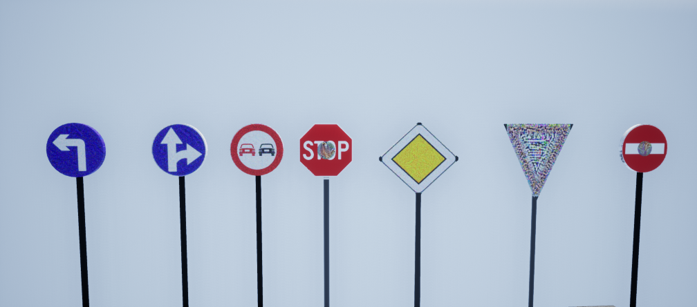

# Add Ons

There are various add ons provide various assets out of these few are suggested here:

1. Modular road: To build the road and bridges
2. Animal Variety pack: Animals, can be commonly used for obstacle detection models
3. Scanned 3D People Pack: Fully driveable - Vehicles like cars and trucks
4. City Object Pack: It has various objects like signboards, dustbins, flag mannequin etc.

