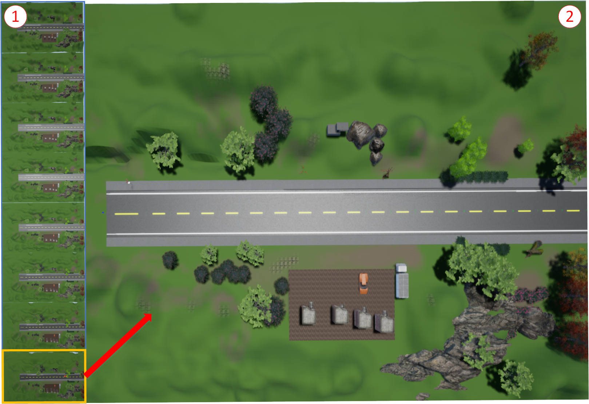

# Environment - 1

This environment is well suited for a repetitive set of experimentation over a set of signs. Detail of this experiment is as described in the research paper.  

A map of the test facility developed within Unreal Engine. The diagram shows a test track for one traffic sign. All the traffic signs are independently arranged in parallel in a non-occluding fashion. High fidelity environment with Real-time ray tracing simulating shadows and reflection. Fine details like objects 1\) cars and buildings 2\) Traffic sign placed at the end of the track 3\) Holdings 4\) detailed rocks and vegetation with shadows 5\) Realistic vegetation 6\) Asphalt like material for the road with lane markings and 7\) water reflecting sun rays.

