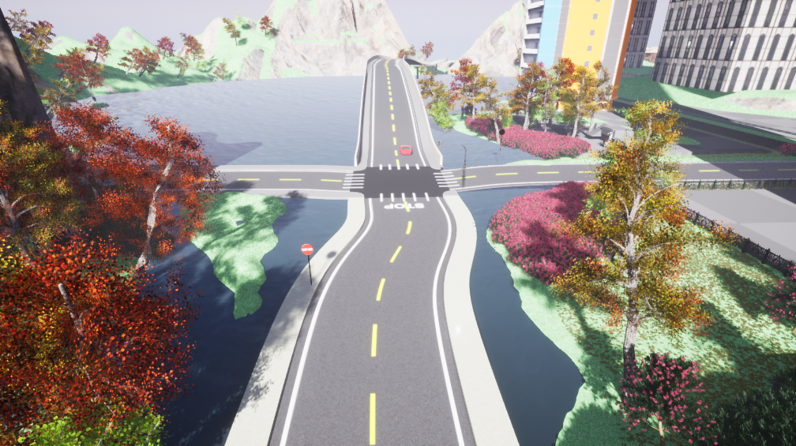

# Environment - 2

This environment is comparatively bigger than the environment -1. This environment has  various kinds of assets including

1. Two lanes and one lane roads
2. Uneven terrain
3. water bodies
4. sky-scrappers
5. Small houses
6. Retail stores
7. Variety of vehicles

Showing the intersection of road with various environmental assets around it

Showing Road and its various elements such as side markings, text over cross-section, different color of asphalt material.

The above diagram shows the bird's eye view of the map. 

Shows real-time reflection from the water body. this can be used to simulate the scenario where water reflection potentially blinds the camera's adaptive focus. 

